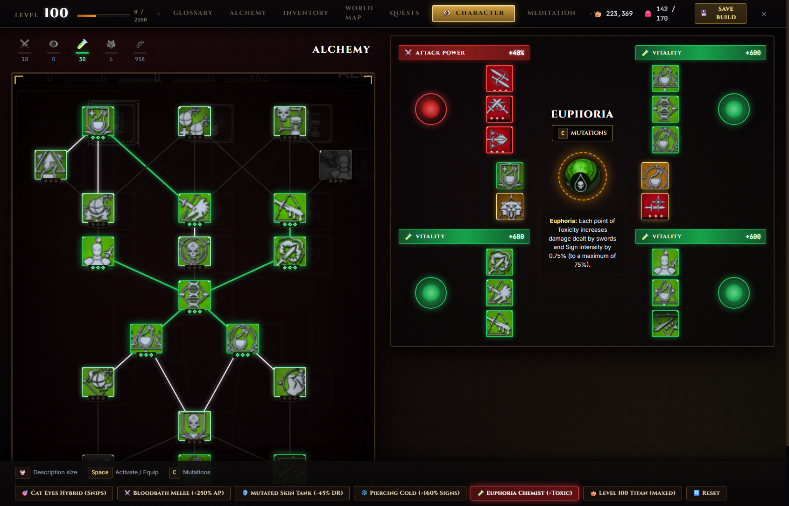

# The Witcher 3: Wild Hunt — Next-Gen v4.0+ Character Development & Skill Calculator

[](https://keithowns.github.io/tw3r-skill-calculator/)
[](https://www.thewitcher.com/)
[](https://react.dev/)
[](https://www.typescriptlang.org/)
[](https://tailwindcss.com/)

A pixel-authentic, 1:1 interactive character development suite and build planner for **The Witcher 3: Wild Hunt (Next-Gen v4.0+)**, including the complete **Blood and Wine** mutation system, mutagen synergies, and slotted ability matrix.

🎮 **[Launch the Live Web Application](https://keithowns.github.io/tw3r-skill-calculator/)**



---

## 🌟 Key Features

### 1. Authentic 4-Tree Ability Canvas (80 Nodes Total)
- **Combat (Red)**: Fast Attack, Strong Attack, Defense, Marksmanship, Battle Trance.
- **Signs (Blue)**: Aard, Igni, Yrden, Quen, Axii (Standard & Alternative casting modes).
- **Alchemy (Green)**: Brewing, Oil Preparation, Bomb Creation, Mutation (20 authentic nodes, 28 conduits, updated v4.0+ potion/bomb stat curves).
- **General (Yellow)**: Armor techniques, survival buffs, Adrenaline bursts, and utility perks.

### 2. Blood and Wine Mutation System
- **Central Mutation Chamber**: Interactive mutagen lab interface matching the Corvo Bianco research laboratory.
- **All 12 Mutations**: *Euphoria, Piercing Cold, Bloodbath, Toxic Blood, Conductors of Magic, Deadly Counter, Cat Eyes, Metamorphosis, Adrenaline Rush, Second Life, Magic Sensibilities, Mutation Synergy*.
- **4 Bonus Ability Slots**: Unlocked dynamically based on research progression with cross-discipline slotting capabilities.

### 3. Slotted Matrix & Mutagen Sockets
- **12 Standard Ability Slots** organized into four 3-slot groups linked to mutagen sockets.
- **4 Mutagen Sockets**: Lesser, Standard, and Greater Mutagens (Red, Blue, Green) providing dynamic group synergy bonuses (+2%/+4%/+6% per matching color ability).
- **Drag-and-Drop & One-Click Slotting**: Effortless ability assignment and reassignment.

### 4. Next-Gen v4.0+ Ground Truth
- Fully calibrated against native 4K captures of the Next-Gen update.
- Authentic 3-rank condensed progression curves (rebalanced from original 5-rank system).
- Accurate toxicity offsets, adrenaline generation multipliers, and sign intensity calculations.

### 5. Presets & Build Sharing
- **Built-in Iconic Builds**:
  - *Toxic Euphoria Alchemist* (Max Toxicity + High Crit Euphoria shredder)
  - *Whirlwind Death* (Pure Fast Attack / Severance adrenaline blender)
  - *Pure Pyromancer Sign Master* (Conductors of Magic + 360° Igni incinerator)
  - *Cat School Critical Assassin* (Light armor + Deadly Counter + High adrenaline burst)
- **URL Build Sharing**: Encodes complete character state (allocated ranks, slotted abilities, active mutagens, researched mutation) into shareable links.

---

## 🧭 Live Web Applications & Tools

| Application | URL | Description |
| :--- | :--- | :--- |
| **Skill Calculator (React 19)** | [Launch App](https://keithowns.github.io/tw3r-skill-calculator/) | Primary production application with full interactivity, animations, and sound |
| **Standalone Calculator Mirror** | [skill_calculator.html](https://keithowns.github.io/tw3r-skill-calculator/skill_calculator.html) | Zero-dependency vanilla JS mirror for lightweight environments |
| **Viewing Experience Optimizer** | [optimizer.html](https://keithowns.github.io/tw3r-skill-calculator/optimizer.html) | Display calibration, gamma tuning, and 4K visual reference suite |

---

## 🛠️ Project Structure

```
tw3r-skill-calculator/
├── index.html                   # Production React SPA entry point (GitHub Pages root)
├── assets/                      # Production JS/CSS bundles, 4K tree backdrops & icons
│   ├── icons/
│   │   ├── combat/              # High-res Combat ability icons
│   │   ├── signs/               # High-res Sign ability icons
│   │   ├── alchemy/             # High-res Alchemy ability icons
│   │   ├── general/             # High-res General ability icons
│   │   └── mutations/           # High-res Mutation orbs
│   ├── alchemy_tree_bg.png      # High-res Alchemy tree conduit backdrop
│   ├── fully_upgraded_clean.png # Master Combat tree backdrop
│   ├── general_tree_bg.png      # High-res General tree backdrop
│   └── signs_tree_bg.png        # High-res Signs tree backdrop
├── skill_calculator.html        # Standalone vanilla JS mirror
├── combat_skills_data.js        # Universal skill definitions & tooltip database
├── optimizer.html               # Calibration and viewing suite
├── HISTORY.md                   # Keep a Changelog formatted history
├── README.md                    # Project documentation
├── .nojekyll                    # GitHub Pages static asset bypass
└── SkillCalculator/             # Source React 19 + TypeScript + Tailwind v4 project
    ├── src/
    │   ├── components/          # React components (Canvas, Matrix, Mutations, Presets)
    │   ├── data/                # Typed skill trees and ground truth stats
    │   ├── types/               # TypeScript interfaces and state models
    │   └── App.tsx              # Root application component
    ├── package.json             # Dev dependencies and build scripts
    ├── vite.config.ts           # Vite bundler configuration (relative base: './')
    └── tsconfig.json            # TypeScript configuration
```

---

## 💻 Local Development

### Prerequisites
- Node.js 20+
- npm or pnpm

### Running Locally
```bash
# Clone the repository
git clone https://github.com/KeithOwns/tw3r-skill-calculator.git
cd tw3r-skill-calculator

# Install dependencies in the SkillCalculator workspace
cd SkillCalculator
npm install

# Start development server
npm run dev
```

### Building for Production
```bash
# From repository root:
npm run build
```

---

## 📜 License

Created for the Witcher community by Keith Tibbitts. Game assets and trademarks belong to CD PROJEKT S.A.
